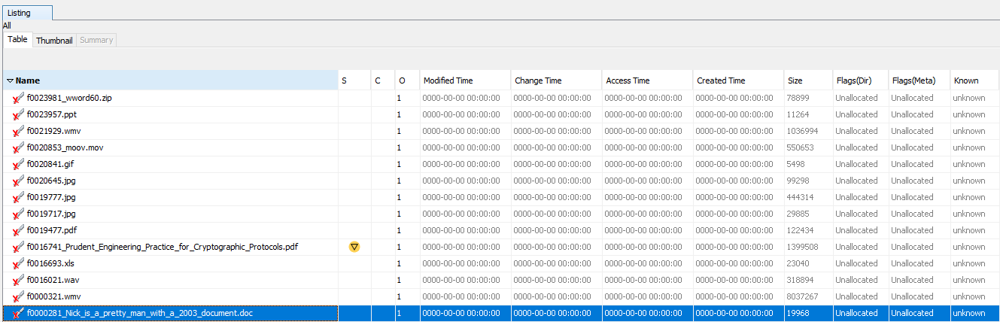
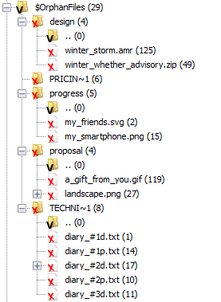
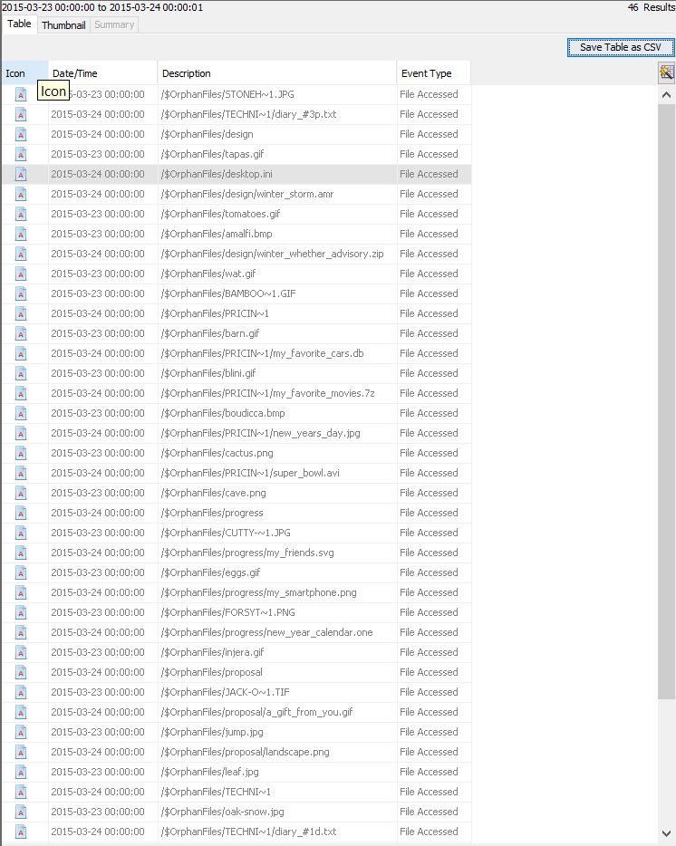
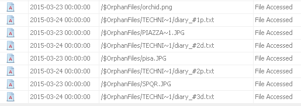
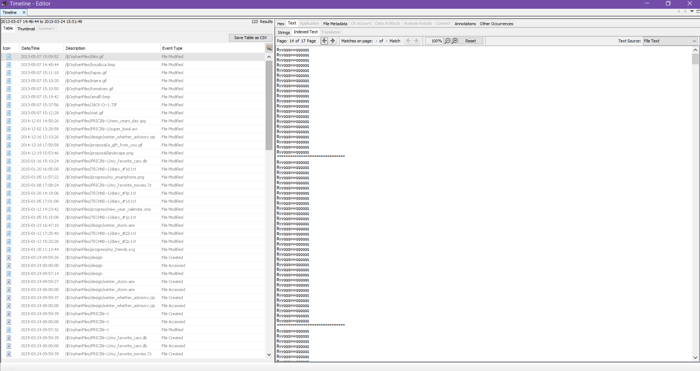
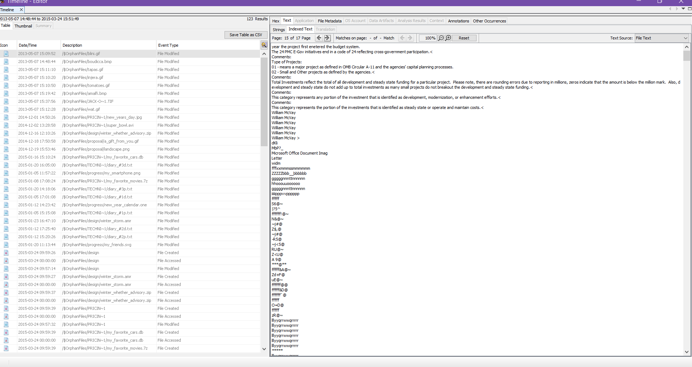
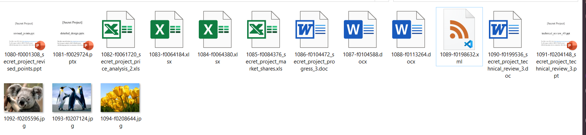

# Activity 10 - Computer Forensics

## Part 1: File Carving

1. Look at the data on the file system (Click on Data Sources and look at the hex values on the right). The file system has no files, but why are we able to find items on the disk image? Explain why the file system has no files but there are items that can be found on the disk image.

Even though the files have been deleted from the file system and become unallocated, the actual data is still there and will not disappear until overwritten, thus items can still be found and opened.

2. How many objects can you find?

14 objects, all deleted files.

3. List all the objects here and report on whether or not the content is accessible or damaged/corrupted. Also note which files were actually already deleted.

All the objects are as follows:

All the content is accessible, but are all already deleted, as file name and metadata are unallocated for all of the files.

4. Think securely: If we want to delete files on a magnetic hard disk and not have them be recovered by any tool, what do we need to do? And how much time do you think you need to wipe a 1TB magnetic hard disk?

We need to format the disk by writing a single pass of zeros to the drive.
The time varies, but according to https://www.techwalla.com/articles/how-long-does-it-take-to-wipe-your-hard-drive 20GB takes 1 hour, so 1TB would take 50 hours.

5. Will file carving be able to recover deleted files on an SSD? Why or why not?

It is nearly impossible on a modern SSD that supports the TRIM command. With TRIM, deleted files are removed immediately and can't be recovered. However it may be possible to disable TRIM by some method.

## Part 2: Investigation

1. List all directories that were traversed in ‘RM#2’.

All of the orphaned directories.

2. List all files that were opened in 'RM#2’.

All the files in these images (they were inside the orphaned directories).

3. Recover deleted files from USB drive ‘RM#2’. What files were you able to recover?

We were able to recover most files from the directories in question 1, but the files were unable to be opened in image viewers even though they were image formats such as `.gif` or `.jpeg`.

4. What actions were performed for anti-forensics on USB drive ‘RM#2’? [Hint: this can be inferred from the results of the above question]

- The file extensions and file names of the 'secret project' files were changed to various formats such as `.gif`, `.jpeg`, or `.one`.
- The files were kept in various separate folders with different names.
- All the suspicious files were orphan files, likely because they were shared through a cloud storage and the storage was deleted.
- Some files were modified by writing repeating strings into the the file, and hiding some data between the repeating strings.

5. Recover hidden files from the CD-R ‘RM#3’. What files were you able to recover?

Multiple Powerpoint, Excel, and Word files about the 'secret project'. After recovery, it was possible to open all of them.

6. What actions were performed for anti-forensics on CD-R ‘RM#3’?

- The files were deleted from storage.
