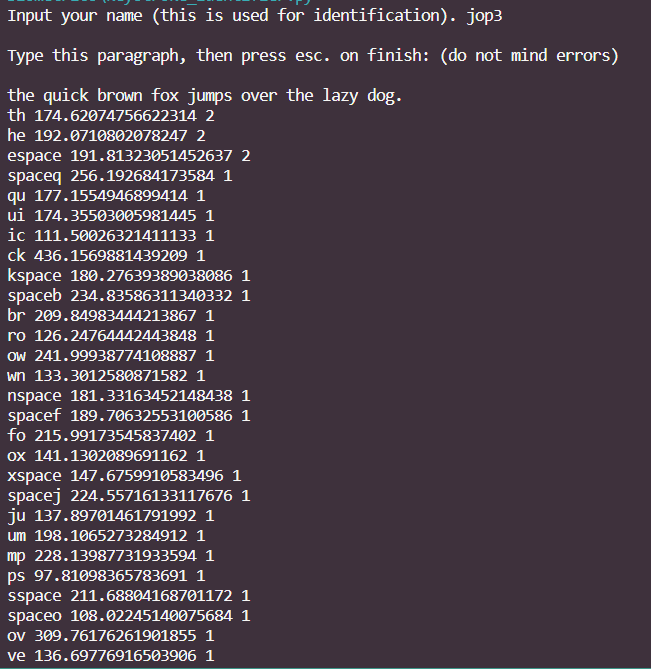
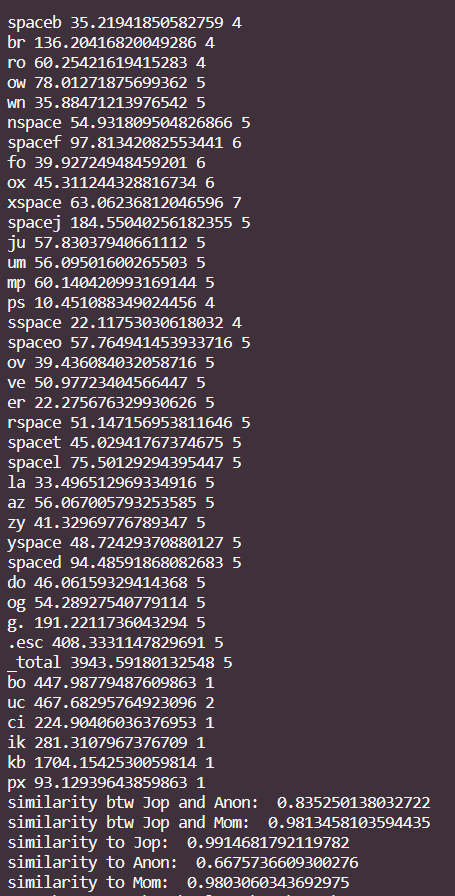

# Activity 11 - Biometrics

## Code

We use the [keyboard](https://pypi.org/project/keyboard/) python library to record keystrokes along with the time, and construct a digraph with a python dictionary.

```python
import keyboard
import json
import numpy as np
from numpy.linalg import norm

def record_digraph(digraph, times):
  print('\nType this paragraph, then press esc. on finish: (do not mind errors)\n')
  print('the quick brown fox jumps over the lazy dog.')
  # print('the quick brown fox jumps over the lazy dog. waltz, bad nymph, for quick jigs vex. sphinx of black quartz, judge my vow. how vexingly quick daft zebras jump!')

  events = keyboard.record(until='escape')
  down_events = []
  for e in events:
    if e.event_type == 'down':
      down_events.append(e)

  for i in range(len(down_events)):
    if i == 0:
      continue
    charpair = down_events[i-1].name + down_events[i].name
    interval = (down_events[i].time - down_events[i-1].time) * 1000
    if charpair in digraph:
      digraph[charpair] += interval
      times[charpair] += 1
    else:
      digraph[charpair] = interval
      times[charpair] = 1

  # total time
  total_time = (down_events[-1].time - down_events[0].time) * 1000
  if '_total' in digraph:
    digraph['_total'] += total_time
    times['_total'] += 1
  else:
    digraph['_total'] = total_time
    times['_total'] = 1

  for key in digraph:
    digraph[key] /= times[key]
    print(key, digraph[key], times[key])
  print()
```

We use [cosine similarity](https://en.wikipedia.org/wiki/Cosine_similarity) to compare two digraphs.

```python
def compare_digraph_cosine(input, baseline):
  input_sorted = dict(sorted(input.items()))
  baseline_sorted = dict(sorted(baseline.items()))

  input_vect = []
  baseline_vect = []

  for key in baseline_sorted.keys():
    if key in input_sorted:
      input_vect.append(input[key])
      baseline_vect.append(baseline[key])

  input_vect = np.array(input_vect)
  baseline_vect = np.array(baseline_vect)
  return np.dot(input_vect, baseline_vect)/(norm(input_vect)*norm(baseline_vect))
```

Finally we also save the digraphs to a file so we can store the data.

```python
def save_digraph_as_json(filename, digraph):
  digraph_json = json.dumps(digraph, indent=4)
  with open(filename, "w") as file:
    file.write(digraph_json)


def read_digraph_json(filename):
  digraph = {}
  with open(filename, "r") as file:
    digraph = json.load(file)
  return digraph
```

```python
# ----- Program Start -----

digraph = {}
times = {}

user = input("Input your name (this is used for identification). ")

for i in range(5):
  record_digraph(digraph, times)

save_digraph_as_json("digraph_" + user + ".json", digraph)

for key in digraph:
    print(key, digraph[key], times[key])

digraph_jop = read_digraph_json("digraph_jop.json")
digraph_anon = read_digraph_json("digraph_Anon.json")
digraph_mom = read_digraph_json("digraph_sonia.json")

diff_jop = compare_digraph_cosine(digraph, digraph_jop)
diff_anon = compare_digraph_cosine(digraph, digraph_anon)
diff_mom = compare_digraph_cosine(digraph, digraph_mom)


print("similarity btw Jop and Anon: ", compare_digraph_cosine(digraph_anon, digraph_jop))
print("similarity btw Jop and Mom: ", compare_digraph_cosine(digraph_mom, digraph_jop))

print("similarity to Jop: ", diff_jop)
print("similarity to Anon: ", diff_anon)
print("similarity to Mom: ", diff_mom)
```

In our program, we have the user type the same message out 5 times and then average the time. Then, we compare the user's digraph to our existing digraphs. Here is some example output.

Output at the digraph recording step:


Output at the comparison step:


The user here is Jop. We can see that this program can recognize Jop from Anon, since there is considerable difference between Jop and Anon's digraph. However the program can hardly separate Jop from Mom because their digraphs are too similar. Thus our program still has limited capability.

1. How many words do we need to correctly identify the person?

Normally, in a real world use case like https://www.typingdna.com/verify, 2-factor authentication uses around 4 words to identify the keystroke pattern.

2. Do you think this method is scalable? (to thousand persons) for either recognition system or identification system. Please provide your analysis.

According to [this paper](https://onlinelibrary.wiley.com/doi/10.1002/ets2.12326), keystrokes dynamics has been reported to be around 5.4% in terms of equal error rate (EER), as compared to 0.2% for fingerprints, which does not scale very well. If normal fingerprints should be used within the range of 1000-5000 people, the keystrokes shoyld be used around a hundred people. Keystrokes should be used as an additional layers of authentication.

3. Will you use this kind of authentication in your system? Please also provide a reason.

As mentioned in the paper above, the keystrokes have much higher error rate than a fingerprints. It may works if our system is used within a hundred users and username and password are not desired. Keystrokes are also cheap because the only need is a keyboard. But as mentioned, keystrokes should be used only as an additional layers of authentication.
