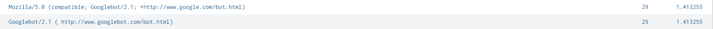

# Activity 3 : Log Analysis

## Part I. Can you find people trying to break into the servers?

1.  How many hackers are trying to get access to our servers? And how many attempts are there? Explain/define how you count distinct hackers.

We will define the hackers as the people who are trying to get into the servers with invalid usernames. Distinct hackers are recognized by distict IP addresses.

From this search query, there are 182 hackers and 24,011 attempts.

2.  What time do hackers appear to try to hack our servers?

00.15 AM of every day available in the data.

3.  Which server (mailsv, www1, www2, www3) sees the most attempts?

www1. However, the percentage of attacks on each server is roughly the same.

4.  What is the most popular account that hackers use to try to break in?

administrator.

---

## Part II. Sensitive Files on Web Servers

5.  Can you find attempts to get access to sensitive information from our web servers? How many attempts were there?

We consider requests that return http responses in the 400-500 range to be an attempt. From the data, there are 5,250 attempts.

6.  What resource/file are hackers looking for?

They are mainly looking for productId SF-BVS-G01 and SF-BVS-01, using these URI paths.

---

## Part III. Are there bots crawling our websites?

7.  Can you find any bots crawling our websites?

Yes, 2 googlebots

8.  What are they doing on the site?

The bots are browsing the products and adding them to cart. This image is an example of the events.

