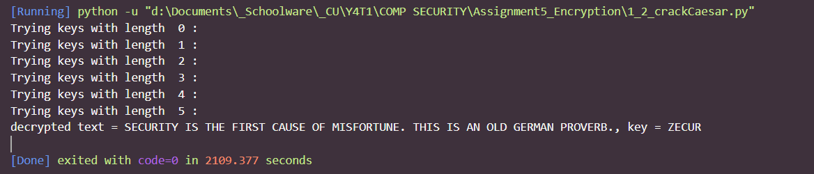
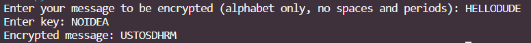
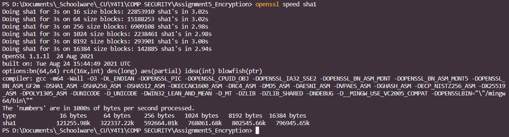
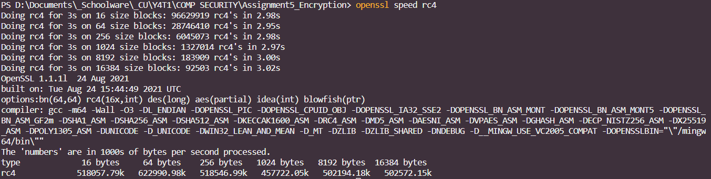
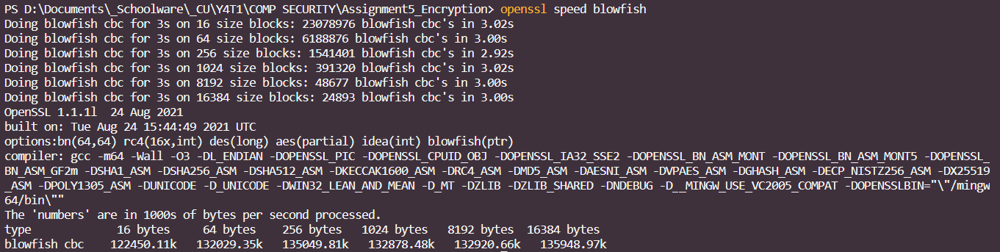
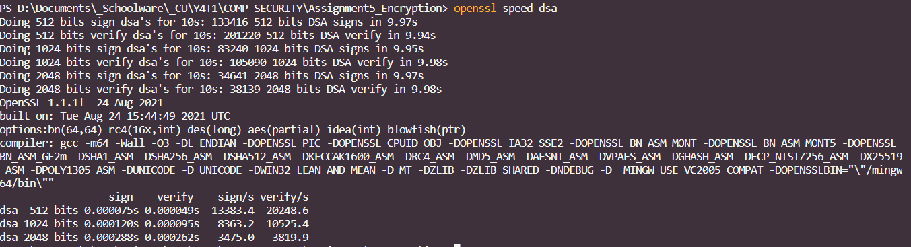

# Activity IV - Fundamentals of Cryptography

## Encryption and Statistical Analysis

### Cipher text

`PRCSOFQX FP QDR AFOPQ CZSPR LA JFPALOQSKR. QDFP FP ZK LIU BROJZK MOLTROE.`

1. Count the frequency of letters. List the top three most frequent characters.

The top 4 most frequent characters are:
| Letter | Frequency |
| ------ | --------- |
| P | 7 |
| R | 6 |
| O | 6 |
| F | 6 |

2. Knowing that this is English, what are commonly used three-letter words and two-letter words. Does the knowledge give you a hint on cracking the given text?

The most common two-letter words are to, of, in, it, is, as, at, be, we, he, so, on, an, or, do, if, up, by, and my.
The most common three-letter words are the, and, are, for, not, but, had, has, was, all, any, one, man, out, you, his, her, and can. ([Reference](http://www.thiagi.com/instructional-puzzles-original/2015/2/13/cryptograms#:~:text=The%20most%20common%20two%2Dletter,his%2C%20her%2C%20and%20can.))

This gives a big hint in cracking the short words.

3. Crack the given text. Measure the time that you have taken to crack this
   message.

   The text is `SECURITY IS THE FIRST CAUSE OF MISFORTUNE. THIS IS AN OLD GERMAN PROVERB`. With knowledge of the most common words, it is possible to crack most of the text _by hand_ within 3 minutes.

4. Explain your process in hacking such messages.

First, consider the 2-letter and 3-letter words. Here FP appears 2 times as the second word in a sentence. This means it is likely a verb, so I guessed FP = IS. To crack QDR, I listed 3-letter words that would make sense after IS - THE, FOR, NOT, etc. I guessed QDR = THE first, and it was correct. After that I filled in the letters already known in the other words, and guessed the whole words from there. With a good sense of the English language and vocabulary, the text could be cracked easily (assuming that the text is semantically and grammatically correct).

5. If you know that the encryption scheme is based on Caesar (Monoalphabetic Substitution) that is commonly used by Caesar for sending messages to Cicero, does it allow you to crack it faster?

(From now on, we will call the string that represents the substitution alphabet the `cipher`.)

Yes. The Caesar Cipher's constraint is that a key is chosen to put at the beginning of the replacement cipher, and then the remaining letters of the alphabet are then added to the cipher in order. This reduces the possible number of ciphers by a lot.

6. Draw a cipher disc of the given text.

Actual A B C D E F G H I J K L M N O P Q R S T U V W X Y Z

Cipher Z E C U R A B D F G H I J K L M N O P Q S T V W X Y


7. Create a simple python for cracking the Caesar cipher text using
   brute force attack. Explain the design and demonstrate your software.
   (You may use an English dictionary for validating results.)

   This code is based on the assumption in question 5 (a key is chosen to put at the beginning of the replacement cipher, and then the remaining letters of the alphabet are then added to the cipher in order).

   We use two libraries: `itertools` for permutations, and `pyenchant` for checking for valid English words.
   ```python
   import itertools
   import enchant

   english_dictionary = enchant.Dict("en_US")
   ```
   ```python
   def decrypt(encrypted_text, cipher):
    decrypted_text = ""
    for c in encrypted_text:
        if c in " .":
            decrypted_text += c
        else:
            decrypted_text += chr(ord("A") + cipher.index(c))
    return decrypted_text

   def is_text_valid(text):
      text = text.split()
      for word in text:
         if(english_dictionary.check(word) == False):
               return False
      return True
    ``` 

    In this code, we brute-force through possible ciphers by generating all possible keys at each key length. For each possible key, we generate its cipher and try decrypting with the cipher. If the result consists of all valid English words, it is the answer.

    ```python
    alphabet = list("ABCDEFGHIJKLMNOPQRSTUVWXYZ")

   has_ans = False

   encrypted_text = input("Enter encrypted text: ")

   for key_length in range(0,10):
      print("Trying keys with length", key_length)
      all_permutations = list(itertools.permutations(alphabet, key_length))
      for permutation in all_permutations: 
         key = ''.join([char for char in permutation])
         cipher = key

         for char in alphabet:
               if char not in key:
                  cipher += char
         
         decrypted_text = decrypt(encrypted_text, cipher)

         if(is_text_valid(decrypted_text)):
               print('decrypted text = ' + decrypted_text + ', key = ' + key)
               has_ans = True
               break

    if(has_ans):
        break
    ```

   Example result:
   

## Symmetric Encryption

Vigenère is a complex version of the Caesar cipher. It is a polyalphabetic substitution.

1. Based on the Caesar cipher, explain how it can be used to cipher data.

In a Caesar cipher, the substitution alphabet is constructed by shifting each letter of the alphabet to the left a certain amount of places. Vigenère expands on that by having 26 substitution alphabets, each shifted 1 to 26 times to the left, corresponding to the 26 possible Caesar Ciphers. The alphabet to be used for ciphering each data is determined by a repeating keyword.

2. If a key is the word `CAT`, please analyze the level of security provided by Vigenère compared to that of the Caesar cipher.
 
The level of security will be compared by considering the number of variations possible of the substitution alphabet.

For a Caesar cipher, only 26 variations are possible.

For Vigenère with `CAT` as the key, assuming the hacker knows the key length is 3, there will be $26^3 = 17,576$ possibilities.

So Vigenère will take roughly 676 times the number of tries to crack.

3. Create a python program for ciphering data using Vigenère.

In this program, we first find the keyword by repeating our key and slicing it to only the length of the message. Then we encrypt each letter by $E_{i} = (m_{i} + k_{i}) mod 26$, where $E_{i}$, $m_{i}$, and $k_{i}$ are character i of the encrypted message, the plaintext message, and the keyword respectively.

```python
message = input("Enter your message to be encrypted (alphabet only, no spaces and periods): ").upper()
key = input("Enter key: ")

keyword = (key * (len(message) // len(key) + 1))[:len(message)]

encrypted_text = ""
for i in range(len(message)):
    e = ord('A') + (ord(message[i]) + ord(keyword[i])) % 26
    encrypted_text += chr(e)

print("Encrypted message:", encrypted_text)
```

Example result:


## Mode in Block Cipher

1. Find a bitmap image that is larger than 2000x2000 pixels. Note that you may resize any image. To simplify the pattern, we will change it to bitmap (1-bit per pixel) using the portable bitmap format (pbm).
`convert image.jpg -resize 2000x2000 org.pbm`

This is the original image:


2. The NetPBM format is a naive image format. The first 1 two lines contain a header (format and size in pixel). Depending on the format, the pixels can be represented in either binary and ascii. For our exercise, we prefer binary. However, we first have to take out the header to prevent the encryption from encoding the header. To do so, use your text editor (eg. vi, notepad) to take out the first two lines.

3. Encrypt the file with OpenSSL2 with any block cipher algorithm in ECB mode (no padding and no salt).
`openssl enc -aes-256-ecb -in org.x -nosalt -out enc.x`

4. Pad the header back and see the result.

Result, ECB:


5. You may try it with other modes with IV, chaining, or feedback and compare the result.

Result, CBC:


6. What does the result suggest about the mode of operation in block cipher? Please provide your analysis.

When we compare the results of ECB (Electronic Codebook) and CBC (Cipher Block Chaining), we can see that ECB still retains an outline of the image in areas where the pixels near each other are different color. Meanwhile in the CBC result, the original image is not visible at all. This suggests that with IV the encryption result will be more difficult to trace back.
## Encryption Protocol - Digital Signature

1. Measure the performance of a hash function (sha1), RC4, Blowfish and DSA. Outline your experimental design. (Please use OpenSSL for your measurement)

We use the command `openssl speed` to measure throughput of `sha1`, `rc4`, `blowfish`, and `dsa`.

Result :

sha1 



rc4



blowfish 



dsa 



The throughput (KB/S) is in this order: `sha1` > `rc4` > `blowfish` > `dsa`.


2. Compare performance and security provided by each method.

`sha1` (a hash function) is the fastest, however it is not reversible so it is not suitable for encryption use cases.

`rc4` (a stream cipher) is the next fastest due to its simplicity, but it also makes it vulnerable and the pseudorandomness of the generated key can be exploited to find patterns and crack the key.

`blowfish` (a block cipher) is next, with an inceased complexity compared to the methods before. It is generally known as secure, but is still subsceptible to certain attacks.

`dsa` (asymmetric key) takes the most time due to being the most complex, but also provides security benefits especially intregity verification.

3. Explain the mechanism underlying Digital Signature. How does it combine the strength and weakness of each encryption scheme?

The concept of Digital Signature Algorithm is that the payload has 2 parts: the data and the signature. The signature is encrypted using the private key and decrypted with the public key, and since the keys are linked, if the signature is decryptable the integrity of the key is verified. There are 4 steps in the process:

1. Generate public and private key.
2. Generate the payload: the original message is hashed, and a signature is generated from this hash and our private key.
3. Send the message along with the public key. No need to try and hide the public key, but do not distribute the private key.
4. The recipent verifies the signature by using the given public key to compare the unhashed message and the signature.

This method combines the strength of both hashing and encryption by using both in the process.