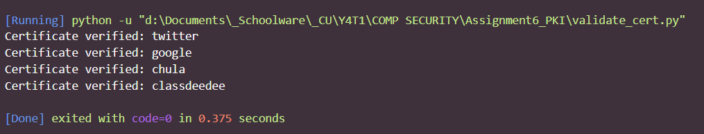

# Activity 6 - Public Key Infrastructure

1. From the two given openssl commands, what is the difference?

In the first command, `openssl s_client -connect twitter.com:443 -CApath /`, no certificate is supplied.

Result of `openssl s_client -connect twitter.com:443 -CApath /`

```
CONNECTED(00000198)
depth=1 C = US, O = DigiCert Inc, CN = DigiCert TLS Hybrid ECC SHA384 2020 CA1
verify error:num=20:unable to get local issuer certificate
verify return:1
depth=0 C = US, ST = California, L = San Francisco, O = "Twitter, Inc.", CN = twitter.com
verify return:1
---
Certificate chain
 0 s:C = US, ST = California, L = San Francisco, O = "Twitter, Inc.", CN = twitter.com
   i:C = US, O = DigiCert Inc, CN = DigiCert TLS Hybrid ECC SHA384 2020 CA1
 1 s:C = US, O = DigiCert Inc, CN = DigiCert TLS Hybrid ECC SHA384 2020 CA1
   i:C = US, O = DigiCert Inc, OU = www.digicert.com, CN = DigiCert Global Root CA
---
Server certificate
-----BEGIN CERTIFICATE-----
MIIFcTCCBPagAwIBAgIQBHwg1EWWtJeHZb2E714udjAKBggqhkjOPQQDAzBWMQsw
CQYDVQQGEwJVUzEVMBMGA1UEChMMRGlnaUNlcnQgSW5jMTAwLgYDVQQDEydEaWdp
Q2VydCBUTFMgSHlicmlkIEVDQyBTSEEzODQgMjAyMCBDQTEwHhcNMjIwMjAyMDAw
MDAwWhcNMjMwMjAxMjM1OTU5WjBoMQswCQYDVQQGEwJVUzETMBEGA1UECBMKQ2Fs
aWZvcm5pYTEWMBQGA1UEBxMNU2FuIEZyYW5jaXNjbzEWMBQGA1UEChMNVHdpdHRl
ciwgSW5jLjEUMBIGA1UEAxMLdHdpdHRlci5jb20wWTATBgcqhkjOPQIBBggqhkjO
PQMBBwNCAAR/wMaDpejym727lzu2vExzjiMzmDGrlp7qtgULiHcrxWTSJOxGFvWg
xmcS/WJpncznh2gaxR8QjrkgFGcRJb+5o4IDkjCCA44wHwYDVR0jBBgwFoAUCrwI
KReMpTlteg7OM8cus+37w3owHQYDVR0OBBYEFAFZo8rUQeLYQL35jIsTyHZ2LQw0
MCcGA1UdEQQgMB6CC3R3aXR0ZXIuY29tgg93d3cudHdpdHRlci5jb20wDgYDVR0P
AQH/BAQDAgeAMB0GA1UdJQQWMBQGCCsGAQUFBwMBBggrBgEFBQcDAjCBmwYDVR0f
BIGTMIGQMEagRKBChkBodHRwOi8vY3JsMy5kaWdpY2VydC5jb20vRGlnaUNlcnRU
TFNIeWJyaWRFQ0NTSEEzODQyMDIwQ0ExLTEuY3JsMEagRKBChkBodHRwOi8vY3Js
NC5kaWdpY2VydC5jb20vRGlnaUNlcnRUTFNIeWJyaWRFQ0NTSEEzODQyMDIwQ0Ex
LTEuY3JsMD4GA1UdIAQ3MDUwMwYGZ4EMAQICMCkwJwYIKwYBBQUHAgEWG2h0dHA6
Ly93d3cuZGlnaWNlcnQuY29tL0NQUzCBhQYIKwYBBQUHAQEEeTB3MCQGCCsGAQUF
BzABhhhodHRwOi8vb2NzcC5kaWdpY2VydC5jb20wTwYIKwYBBQUHMAKGQ2h0dHA6
Ly9jYWNlcnRzLmRpZ2ljZXJ0LmNvbS9EaWdpQ2VydFRMU0h5YnJpZEVDQ1NIQTM4
NDIwMjBDQTEtMS5jcnQwDAYDVR0TAQH/BAIwADCCAX4GCisGAQQB1nkCBAIEggFu
BIIBagFoAHcArfe++nz/EMiLnT2cHj4YarRnKV3PsQwkyoWGNOvcgooAAAF+vB6h
AAAABAMASDBGAiEA19g4sdiGYzBJOd4sTFWGzbz7LxaEtmMWG/K34bUGHngCIQCe
I+Zs6Rc78Z3FQEKRx6AGr1e0gHLfVZi0QCAuwpTbfwB2ADXPGRu/sWxXvw+tTG1C
y7u2JyAmUeo/4SrvqAPDO9ZMAAABfrweoNMAAAQDAEcwRQIgQvl2vdwUL8IR7xI6
U/W9Xy7MHdOFDRFIElOhTu4/d5QCIQDw6Wot/ipG5/kqUSY9WHdhvPdxGYmlbBmo
URomLgkr1AB1ALNzdwfhhFD4Y4bWBancEQlKeS2xZwwLh9zwAw55NqWaAAABfrwe
oPEAAAQDAEYwRAIgcp86Z42gWXVRm04rZdnq5g8WpiK3jcUbRpfWs/lkSDcCIDQS
AX5JPvuQ/KVDzYmkYQ2+1QoPNVLMDRCcCSFTjBgLMAoGCCqGSM49BAMDA2kAMGYC
MQD4fgTKQZYGCKC2aSwx0ir0a/pFXiUbbCn+PLDDnpaDR/Bu4I08nwd+OXKv0q3C
Z2QCMQClQPCqm6O4B3BE1N5b4sYX4M2ksk/olZBjxNkdXnx5f89Xi+kVbeJAy8cE
aEH6WTk=
-----END CERTIFICATE-----
subject=C = US, ST = California, L = San Francisco, O = "Twitter, Inc.", CN = twitter.com

issuer=C = US, O = DigiCert Inc, CN = DigiCert TLS Hybrid ECC SHA384 2020 CA1

---
No client certificate CA names sent
Peer signing digest: SHA256
Peer signature type: ECDSA
Server Temp Key: X25519, 253 bits
---
SSL handshake has read 2757 bytes and written 393 bytes
Verification error: unable to get local issuer certificate
---
New, TLSv1.3, Cipher is TLS_AES_256_GCM_SHA384
Server public key is 256 bit
Secure Renegotiation IS NOT supported
Compression: NONE
Expansion: NONE
No ALPN negotiated
Early data was not sent
Verify return code: 20 (unable to get local issuer certificate)
---
GET / HTTP/1.0

---
Post-Handshake New Session Ticket arrived:
SSL-Session:
    Protocol  : TLSv1.3
    Cipher    : TLS_AES_256_GCM_SHA384
    Session-ID: CDED42863FF186E23504F172829ADB6307C92A2F8C14A9347D1383B6509E98D2
    Session-ID-ctx:
    Resumption PSK: 734FB68380AB0ADC1870D0177BB69292A8325943529FC5E6F578A557678DC305AEE34F8CE80C86B780B142D579E0ACBA
    PSK identity: None
    PSK identity hint: None
    SRP username: None
    TLS session ticket lifetime hint: 172800 (seconds)
    TLS session ticket:
    0000 - 71 a6 fa 04 92 13 3b d4-dd b2 20 56 b2 09 e1 ab   q.....;... V....
    0010 - 9d 2a 3f 51 17 c5 cd 82-de 8a dd 41 46 1f 2a 39   .*?Q.......AF.*9
    0020 - 88 f3 0c 60 68 95 4a eb-24 21 ae bc 3c 6a 86 99   ...`h.J.$!..<j..
    0030 - 2d e0 b5 d1 5d 5b 0e c0-17 6c 02 3a d2 ae 15 25   -...][...l.:...%
    0040 - 65 f9 d8 08 44 4d f1 23-5d bc 29 d1 93 bf 44 ba   e...DM.#].)...D.
    0050 - 47 1a 62 fb ae 69 85 9c-97 57 1f 90 10 d4 9c de   G.b..i...W......
    0060 - fd 87 83 13 0f cb 60 f7-25 3a d0 1b b0 63 c0 ae   ......`.%:...c..
    0070 - 31 66 e2 f5 e3 23 2f 0c-7c a0 4d 64 26 60 91 fd   1f...#/.|.Md&`..
    0080 - 00 ed 0c 75 f0 1b 31 61-92 64 16 cb 3e eb 0a 11   ...u..1a.d..>...
    0090 - bb 42 fe 01 0e ec a8 72-17 68 7c cd a8 f4 8c 7f   .B.....r.h|.....
    00a0 - 9f 68 77 a1 e4 9a 70 2f-5e 3f 66 16 d3 55 5f fa   .hw...p/^?f..U_.
    00b0 - 30 7b 07 de 2b b9 61 f8-09 ce da 05 a2 61 4b e3   0{..+.a......aK.
    00c0 - 2a c6 c7 7e f5 a6 14 51-dc 59 f5 cd 5e 18 20 50   *..~...Q.Y..^. P

    Start Time: 1663041190
    Timeout   : 7200 (sec)
    Verify return code: 20 (unable to get local issuer certificate)
    Extended master secret: no
    Max Early Data: 0
---
read R BLOCK
---
Post-Handshake New Session Ticket arrived:
SSL-Session:
    Protocol  : TLSv1.3
    Cipher    : TLS_AES_256_GCM_SHA384
    Session-ID: B0EB570858757B4320802CB57C5E2236B9542276677517C2A4A62F7F591EF3CD
    Session-ID-ctx:
    Resumption PSK: C42C36FAE0DA23F132818C3A49F8891DD3CAEE1C1D451852CCDB45C57CDFF128C75B54BCB17110B3B9CBEAAD69EF29FD
    PSK identity: None
    PSK identity hint: None
    SRP username: None
    TLS session ticket lifetime hint: 172800 (seconds)
    TLS session ticket:
    0000 - 71 a6 fa 04 92 13 3b d4-dd b2 20 56 b2 09 e1 ab   q.....;... V....
    0010 - be 70 c4 cf 07 56 71 90-eb 92 98 18 0d 88 2f 98   .p...Vq......./.
    0020 - d6 91 f9 e1 6e ac ca 2a-7d bf aa c7 43 4f a0 f1   ....n..*}...CO..
    0030 - e6 67 98 2d a2 c3 d1 ab-28 14 9e 32 a6 d5 69 be   .g.-....(..2..i.
    0040 - 0b ee 10 b3 1f 8c f5 49-df 63 3b c7 09 45 15 1c   .......I.c;..E..
    0050 - 14 57 e0 d7 d1 8f 62 a3-79 ca 38 3e 5d b9 b7 a8   .W....b.y.8>]...
    0060 - 75 b3 3e 92 f5 4b bb cf-4e 76 ea 07 67 39 49 a9   u.>..K..Nv..g9I.
    0070 - 66 02 f6 7d f1 3d 39 da-1e ee c0 7d 52 23 61 8a   f..}.=9....}R#a.
    0080 - 2a ea 48 b5 57 5a 80 b8-01 99 f6 78 51 f2 f4 7a   *.H.WZ.....xQ..z
    0090 - 50 11 84 1d 1f e3 6e ac-f7 3b 1a 26 37 6c b5 2d   P.....n..;.&7l.-
    00a0 - f8 12 dd 80 76 c9 76 47-a9 d3 09 93 35 d2 20 5b   ....v.vG....5. [
    00b0 - 13 8d 1c 2f a4 06 33 0c-68 c4 1a 6f bd 80 7b 2a   .../..3.h..o..{*
    00c0 - 28 cf df b1 f3 b3 19 22-bf 3b 48 be 62 58 60 ec   (......".;H.bX`.

    Start Time: 1663041190
    Timeout   : 7200 (sec)
    Verify return code: 20 (unable to get local issuer certificate)
    Extended master secret: no
    Max Early Data: 0
---
read R BLOCK
HTTP/1.0 400 Bad Request
x-connection-hash: fdc8182f5b0c7f45c42ac065f0abe02260c76817202ed8ed2f8506fe548e9195
date: Tue, 13 Sep 2022 03:53:09 GMT
server: tsa_k
connection: close
content-length: 0

closed
```

In the second command, `openssl s_client -connect twitter.com:443 -CApath -CAfile ca-certificates.crt`, we supply a certificate locally.

Result of `openssl s_client -connect twitter.com:443 -CAfile ca-certificates.crt`

```
CONNECTED(000001A0)
depth=2 C = US, O = DigiCert Inc, OU = www.digicert.com, CN = DigiCert Global Root CA
verify return:1
depth=1 C = US, O = DigiCert Inc, CN = DigiCert TLS Hybrid ECC SHA384 2020 CA1
verify return:1
depth=0 C = US, ST = California, L = San Francisco, O = "Twitter, Inc.", CN = twitter.com
verify return:1
---
Certificate chain
 0 s:C = US, ST = California, L = San Francisco, O = "Twitter, Inc.", CN = twitter.com
   i:C = US, O = DigiCert Inc, CN = DigiCert TLS Hybrid ECC SHA384 2020 CA1
 1 s:C = US, O = DigiCert Inc, CN = DigiCert TLS Hybrid ECC SHA384 2020 CA1
   i:C = US, O = DigiCert Inc, OU = www.digicert.com, CN = DigiCert Global Root CA
---
Server certificate
-----BEGIN CERTIFICATE-----
MIIFcTCCBPagAwIBAgIQBHwg1EWWtJeHZb2E714udjAKBggqhkjOPQQDAzBWMQsw
CQYDVQQGEwJVUzEVMBMGA1UEChMMRGlnaUNlcnQgSW5jMTAwLgYDVQQDEydEaWdp
Q2VydCBUTFMgSHlicmlkIEVDQyBTSEEzODQgMjAyMCBDQTEwHhcNMjIwMjAyMDAw
MDAwWhcNMjMwMjAxMjM1OTU5WjBoMQswCQYDVQQGEwJVUzETMBEGA1UECBMKQ2Fs
aWZvcm5pYTEWMBQGA1UEBxMNU2FuIEZyYW5jaXNjbzEWMBQGA1UEChMNVHdpdHRl
ciwgSW5jLjEUMBIGA1UEAxMLdHdpdHRlci5jb20wWTATBgcqhkjOPQIBBggqhkjO
PQMBBwNCAAR/wMaDpejym727lzu2vExzjiMzmDGrlp7qtgULiHcrxWTSJOxGFvWg
xmcS/WJpncznh2gaxR8QjrkgFGcRJb+5o4IDkjCCA44wHwYDVR0jBBgwFoAUCrwI
KReMpTlteg7OM8cus+37w3owHQYDVR0OBBYEFAFZo8rUQeLYQL35jIsTyHZ2LQw0
MCcGA1UdEQQgMB6CC3R3aXR0ZXIuY29tgg93d3cudHdpdHRlci5jb20wDgYDVR0P
AQH/BAQDAgeAMB0GA1UdJQQWMBQGCCsGAQUFBwMBBggrBgEFBQcDAjCBmwYDVR0f
BIGTMIGQMEagRKBChkBodHRwOi8vY3JsMy5kaWdpY2VydC5jb20vRGlnaUNlcnRU
TFNIeWJyaWRFQ0NTSEEzODQyMDIwQ0ExLTEuY3JsMEagRKBChkBodHRwOi8vY3Js
NC5kaWdpY2VydC5jb20vRGlnaUNlcnRUTFNIeWJyaWRFQ0NTSEEzODQyMDIwQ0Ex
LTEuY3JsMD4GA1UdIAQ3MDUwMwYGZ4EMAQICMCkwJwYIKwYBBQUHAgEWG2h0dHA6
Ly93d3cuZGlnaWNlcnQuY29tL0NQUzCBhQYIKwYBBQUHAQEEeTB3MCQGCCsGAQUF
BzABhhhodHRwOi8vb2NzcC5kaWdpY2VydC5jb20wTwYIKwYBBQUHMAKGQ2h0dHA6
Ly9jYWNlcnRzLmRpZ2ljZXJ0LmNvbS9EaWdpQ2VydFRMU0h5YnJpZEVDQ1NIQTM4
NDIwMjBDQTEtMS5jcnQwDAYDVR0TAQH/BAIwADCCAX4GCisGAQQB1nkCBAIEggFu
BIIBagFoAHcArfe++nz/EMiLnT2cHj4YarRnKV3PsQwkyoWGNOvcgooAAAF+vB6h
AAAABAMASDBGAiEA19g4sdiGYzBJOd4sTFWGzbz7LxaEtmMWG/K34bUGHngCIQCe
I+Zs6Rc78Z3FQEKRx6AGr1e0gHLfVZi0QCAuwpTbfwB2ADXPGRu/sWxXvw+tTG1C
y7u2JyAmUeo/4SrvqAPDO9ZMAAABfrweoNMAAAQDAEcwRQIgQvl2vdwUL8IR7xI6
U/W9Xy7MHdOFDRFIElOhTu4/d5QCIQDw6Wot/ipG5/kqUSY9WHdhvPdxGYmlbBmo
URomLgkr1AB1ALNzdwfhhFD4Y4bWBancEQlKeS2xZwwLh9zwAw55NqWaAAABfrwe
oPEAAAQDAEYwRAIgcp86Z42gWXVRm04rZdnq5g8WpiK3jcUbRpfWs/lkSDcCIDQS
AX5JPvuQ/KVDzYmkYQ2+1QoPNVLMDRCcCSFTjBgLMAoGCCqGSM49BAMDA2kAMGYC
MQD4fgTKQZYGCKC2aSwx0ir0a/pFXiUbbCn+PLDDnpaDR/Bu4I08nwd+OXKv0q3C
Z2QCMQClQPCqm6O4B3BE1N5b4sYX4M2ksk/olZBjxNkdXnx5f89Xi+kVbeJAy8cE
aEH6WTk=
-----END CERTIFICATE-----
subject=C = US, ST = California, L = San Francisco, O = "Twitter, Inc.", CN = twitter.com

issuer=C = US, O = DigiCert Inc, CN = DigiCert TLS Hybrid ECC SHA384 2020 CA1

---
No client certificate CA names sent
Peer signing digest: SHA256
Peer signature type: ECDSA
Server Temp Key: X25519, 253 bits
---
SSL handshake has read 2758 bytes and written 393 bytes
Verification: OK
---
New, TLSv1.3, Cipher is TLS_AES_256_GCM_SHA384
Server public key is 256 bit
Secure Renegotiation IS NOT supported
Compression: NONE
Expansion: NONE
No ALPN negotiated
Early data was not sent
Verify return code: 0 (ok)
---
GET / HTTP/1.0

---
Post-Handshake New Session Ticket arrived:
SSL-Session:
    Protocol  : TLSv1.3
    Cipher    : TLS_AES_256_GCM_SHA384
    Session-ID: 00A4A3F7C1505E2C9C6184F9C38E127DFE568C02D345D545D95E27D37808E459
    Session-ID-ctx:
    Resumption PSK: AC0D3B4F37B236F2C79ACC74953435C02395B0760BE454A091A4F47AA4BDA75038454F9E1BCAC5ED4D441745A1101F50
    PSK identity: None
    PSK identity hint: None
    SRP username: None
    TLS session ticket lifetime hint: 172800 (seconds)
    TLS session ticket:
    0000 - b3 c2 e6 1f 16 7d 45 2b-4f fc c7 eb b7 98 77 24   .....}E+O.....w$
    0010 - 9a a1 54 df ad 47 92 0b-79 76 e6 a0 ee c8 50 ab   ..T..G..yv....P.
    0020 - 21 c9 49 fd 4a 16 b4 01-bd 8f 7d 15 4d b9 cd b1   !.I.J.....}.M...
    0030 - 46 04 89 99 70 0f e5 3e-0b 7c c6 85 2a 6c 86 57   F...p..>.|..*l.W
    0040 - b3 fc d9 fd 6e a5 bf d3-4e 7c a4 f1 30 c0 c4 7a   ....n...N|..0..z
    0050 - fb b5 8e cb 23 33 7b 27-b7 a9 81 27 42 6b f7 e5   ....#3{'...'Bk..
    0060 - 56 fa 0b 53 3d 22 1c 1e-44 a2 ea 6c 75 e6 f6 9c   V..S="..D..lu...
    0070 - 65 a4 f1 c7 b5 90 a7 b6-52 cd 0c 5c ff a4 b4 ef   e.......R..\....
    0080 - 38 7e fa 3e 50 fc 5c f9-1e 37 a5 62 cb bb dd ba   8~.>P.\..7.b....
    0090 - b8 c0 19 52 b8 fc 95 8c-b9 59 e8 02 ab 52 d5 a9   ...R.....Y...R..
    00a0 - 81 d5 47 51 07 4e f3 ab-78 7b 1f 85 b3 32 bd 96   ..GQ.N..x{...2..
    00b0 - 3e 84 ef 08 16 0d 84 5c-07 de ad b3 fb 3c 21 50   >......\.....<!P
    00c0 - 7c 0c 30 10 2a 7f c3 05-39 a3 54 fd c3 e7 f5 9a   |.0.*...9.T.....

    Start Time: 1663041955
    Timeout   : 7200 (sec)
    Verify return code: 0 (ok)
    Extended master secret: no
    Max Early Data: 0
---
read R BLOCK
---
Post-Handshake New Session Ticket arrived:
SSL-Session:
    Protocol  : TLSv1.3
    Cipher    : TLS_AES_256_GCM_SHA384
    Session-ID: 532B429CBBA548CFC0238632110DB34B1BCFED76AB7151ADFC16E9B6F746B8C1
    Session-ID-ctx:
    Resumption PSK: E4514F884A02E226A3D05D8933FC95389BA9ED8B1FF0B6229B2126D6E91A41B14E4AD0FA42DF9C6A066BB59A40BB431F
    PSK identity: None
    PSK identity hint: None
    SRP username: None
    TLS session ticket lifetime hint: 172800 (seconds)
    TLS session ticket:
    0000 - b3 c2 e6 1f 16 7d 45 2b-4f fc c7 eb b7 98 77 24   .....}E+O.....w$
    0010 - a6 db eb 43 08 f7 e0 5c-84 03 fc a6 e0 73 e0 b2   ...C...\.....s..
    0020 - 85 e7 56 ca 31 89 52 c2-6f 8b 31 72 c5 56 a2 af   ..V.1.R.o.1r.V..
    0030 - 6c 09 c8 fb d4 41 46 87-a0 aa a9 3e fa e2 2c c1   l....AF....>..,.
    0040 - ce b5 5b 8f 1c a9 79 a9-69 b9 b9 2c 44 44 36 4c   ..[...y.i..,DD6L
    0050 - 22 d9 e0 4c 00 cf 3a 3f-30 ff 4f 3a 78 b4 69 5f   "..L..:?0.O:x.i_
    0060 - 9a f2 ee fa 10 fd 6c fd-43 32 73 a1 de 55 71 ee   ......l.C2s..Uq.
    0070 - f7 62 4e 54 cc a6 23 05-15 31 f0 e1 ab 40 a6 ef   .bNT..#..1...@..
    0080 - 70 fc 7d a1 de 15 75 24-a4 bf b7 93 a2 a5 68 94   p.}...u$......h.
    0090 - 62 7a fb 55 56 e4 28 fc-33 c3 a1 dd 5e cb a0 73   bz.UV.(.3...^..s
    00a0 - 97 6b f2 76 53 3a ec 50-de ac ae d6 eb 33 e4 28   .k.vS:.P.....3.(
    00b0 - 76 50 13 3b da cf 18 aa-8c 58 88 39 78 3b 01 6a   vP.;.....X.9x;.j
    00c0 - 9d 79 c9 3b f0 04 0c ae-93 1f 48 f6 08 52 fd d5   .y.;......H..R..

    Start Time: 1663041955
    Timeout   : 7200 (sec)
    Verify return code: 0 (ok)
    Extended master secret: no
    Max Early Data: 0
---
read R BLOCK
HTTP/1.0 400 Bad Request
x-connection-hash: 97ad875ccaa889f69c68bafddc51e43684eb7148e1283b3e5164d714cc71c6d2
date: Tue, 13 Sep 2022 04:05:54 GMT
server: tsa_k
connection: close
content-length: 0

closed
```

The difference is that the first command gives `Verify return code: 20 (unable to get local issuer certificate)` while the second results in `Verify return code: 0 (ok)`.

2. What does the error (verify error) in the first command mean? Please explain.

It means that we are unable to verify if the received public key is valid (is it owned by who we think it is), because the certificate is not found.

3. Copy the server certificate (beginning with -----BEGIN CERTIFICATE----- and ending with -----END CERTIFICATE-----) and store it as twitter_com.cert. Use the command `openssl x509 -in twitter_com.cert -text` to show a text representation of the certificate content. Briefly explain what is stored in an X.509 certificate (i.e. data in each field).

The results of the command is as follows. (Explanations are commented behind the field, and may not be provided for some self-explanatory stuff.)

```yaml
Certificate:
    Data:
        Version: 3 (0x2)
        Serial Number:
            04:7c:20:d4:45:96:b4:97:87:65:bd:84:ef:5e:2e:76 # unique identifier for each certificate generated by an certificate issuer
        Signature Algorithm: ecdsa-with-SHA384 # algorithm used to sign
        Issuer: C = US, O = DigiCert Inc, CN = DigiCert TLS Hybrid ECC SHA384 2020 CA1 # issuer, all tiers
        Validity # valid time period
            Not Before: Feb  2 00:00:00 2022 GMT
            Not After : Feb  1 23:59:59 2023 GMT
        Subject: C = US, ST = California, L = San Francisco, O = "Twitter, Inc.", CN = twitter.com # the entity that is secured by this certified public key, in this case twitter.com
        Subject Public Key Info: # public key of twitter.com
            Public Key Algorithm: id-ecPublicKey
                Public-Key: (256 bit)
                pub:
                    04:7f:c0:c6:83:a5:e8:f2:9b:bd:bb:97:3b:b6:bc:
                    4c:73:8e:23:33:98:31:ab:96:9e:ea:b6:05:0b:88:
                    77:2b:c5:64:d2:24:ec:46:16:f5:a0:c6:67:12:fd:
                    62:69:9d:cc:e7:87:68:1a:c5:1f:10:8e:b9:20:14:
                    67:11:25:bf:b9
                ASN1 OID: prime256v1
                NIST CURVE: P-256
        X509v3 extensions: # additional attributes that can be added to provide information
            X509v3 Authority Key Identifier: # object id for the public key of issuer
                keyid:0A:BC:08:29:17:8C:A5:39:6D:7A:0E:CE:33:C7:2E:B3:ED:FB:C3:7A

            X509v3 Subject Key Identifier: # object id of public key of subject
                01:59:A3:CA:D4:41:E2:D8:40:BD:F9:8C:8B:13:C8:76:76:2D:0C:34
            X509v3 Subject Alternative Name: # name of subject
                DNS:twitter.com, DNS:www.twitter.com
            X509v3 Key Usage: critical # purposes of using the key in this cert
                Digital Signature
            X509v3 Extended Key Usage: # purposes of using the certified key
                TLS Web Server Authentication, TLS Web Client Authentication
            X509v3 CRL Distribution Points:

                Full Name:
                  URI:http://crl3.digicert.com/DigiCertTLSHybridECCSHA3842020CA1-1.crl

                Full Name:
                  URI:http://crl4.digicert.com/DigiCertTLSHybridECCSHA3842020CA1-1.crl

            X509v3 Certificate Policies:
                Policy: 2.23.140.1.2.2
                  CPS: http://www.digicert.com/CPS

            Authority Information Access: # information on issuer 
                OCSP - URI:http://ocsp.digicert.com
                CA Issuers - URI:http://cacerts.digicert.com/DigiCertTLSHybridECCSHA3842020CA1-1.crt

            X509v3 Basic Constraints: critical # used during cert verification process to apply path length constraints
                CA:FALSE
            CT Precertificate SCTs: 
                Signed Certificate Timestamp:
                    Version   : v1 (0x0)
                    Log ID    : AD:F7:BE:FA:7C:FF:10:C8:8B:9D:3D:9C:1E:3E:18:6A:
                                B4:67:29:5D:CF:B1:0C:24:CA:85:86:34:EB:DC:82:8A
                    Timestamp : Feb  2 20:27:10.976 2022 GMT
                    Extensions: none
                    Signature : ecdsa-with-SHA256
                                30:46:02:21:00:D7:D8:38:B1:D8:86:63:30:49:39:DE:
                                2C:4C:55:86:CD:BC:FB:2F:16:84:B6:63:16:1B:F2:B7:
                                E1:B5:06:1E:78:02:21:00:9E:23:E6:6C:E9:17:3B:F1:
                                9D:C5:40:42:91:C7:A0:06:AF:57:B4:80:72:DF:55:98:
                                B4:40:20:2E:C2:94:DB:7F
                Signed Certificate Timestamp:
                    Version   : v1 (0x0)
                    Log ID    : 35:CF:19:1B:BF:B1:6C:57:BF:0F:AD:4C:6D:42:CB:BB:
                                B6:27:20:26:51:EA:3F:E1:2A:EF:A8:03:C3:3B:D6:4C
                    Timestamp : Feb  2 20:27:10.931 2022 GMT
                    Extensions: none
                    Signature : ecdsa-with-SHA256
                                30:45:02:20:42:F9:76:BD:DC:14:2F:C2:11:EF:12:3A:
                                53:F5:BD:5F:2E:CC:1D:D3:85:0D:11:48:12:53:A1:4E:
                                EE:3F:77:94:02:21:00:F0:E9:6A:2D:FE:2A:46:E7:F9:
                                2A:51:26:3D:58:77:61:BC:F7:71:19:89:A5:6C:19:A8:
                                51:1A:26:2E:09:2B:D4
                Signed Certificate Timestamp:
                    Version   : v1 (0x0)
                    Log ID    : B3:73:77:07:E1:84:50:F8:63:86:D6:05:A9:DC:11:09:
                                4A:79:2D:B1:67:0C:0B:87:DC:F0:03:0E:79:36:A5:9A
                    Timestamp : Feb  2 20:27:10.961 2022 GMT
                    Extensions: none
                    Signature : ecdsa-with-SHA256
                                30:44:02:20:72:9F:3A:67:8D:A0:59:75:51:9B:4E:2B:
                                65:D9:EA:E6:0F:16:A6:22:B7:8D:C5:1B:46:97:D6:B3:
                                F9:64:48:37:02:20:34:12:01:7E:49:3E:FB:90:FC:A5:
                                43:CD:89:A4:61:0D:BE:D5:0A:0F:35:52:CC:0D:10:9C:
                                09:21:53:8C:18:0B
    Signature Algorithm: ecdsa-with-SHA384 # algorithm used to sign and full signature
         30:66:02:31:00:f8:7e:04:ca:41:96:06:08:a0:b6:69:2c:31:
         d2:2a:f4:6b:fa:45:5e:25:1b:6c:29:fe:3c:b0:c3:9e:96:83:
         47:f0:6e:e0:8d:3c:9f:07:7e:39:72:af:d2:ad:c2:67:64:02:
         31:00:a5:40:f0:aa:9b:a3:b8:07:70:44:d4:de:5b:e2:c6:17:
         e0:cd:a4:b2:4f:e8:95:90:63:c4:d9:1d:5e:7c:79:7f:cf:57:
         8b:e9:15:6d:e2:40:cb:c7:04:68:41:fa:59:39
```
Source
- https://access.redhat.com/documentation/en-us/red_hat_certificate_system/9/html/administration_guide/standard_x.509_v3_certificate_extensions

4. From the information in exercise 3, is there an intermediate certificate? If yes, what purpose does it serve?

Yes, it is used to authenticate the intermediate TLS Server, DigiCert TLS Hybrid ECC SHA384 2020 CA1. 

5. Is there an intermediate CA, i.e. is there more than one organization involved in the certification? Say why you think so.

Yes there is, because the results from running `openssl s_client -connect twitter.com:443` show that verification happens 3 times:
```
depth=2 C = US, O = DigiCert Inc, OU = www.digicert.com, CN = DigiCert Global Root CA
verify return:1
depth=1 C = US, O = DigiCert Inc, CN = DigiCert TLS Hybrid ECC SHA384 2020 CA1
verify return:1
depth=0 C = US, ST = California, L = San Francisco, O = "Twitter, Inc.", CN = twitter.com
verify return:1
```
The first cert is of the root CA, and is on our computer. With our request we get the intermediate CA's cert, and then finally Twitter's cert.

6. What is the role of ca-certificates.crt?

It is the certificate of CAs the computer already knows. Its role is a significant part of the web of trust - these CAs are considered trusted third parties, so these parties' public keys are kept in our devices, and will be used to validate any certificates certified by them. If the validation is a success, the subject of the cert is trusted by our device.

7. Explore the ca-certificates.crt. How many certificates are in there? Give the command/method you have used to count.

`openssl storeutl -noout -certs ca-certificates.crt` counts 127 certificates.

`openssl crl2pkcs7 -nocrl -certfile ca-certificates.crt | openssl pkcs7 -print_certs -noout` can also provide information on all certificates.

8. Extract a root certificate from ca-certificates.crt. Use the openssl command to explore the details. Do you see any Issuer information? Please compare it to the details of twitter’s certificate and the details of the intermediate certificate.

The root certificate's details are as follows: 

```yaml
Certificate:
    Data:
        Version: 3 (0x2)
        Serial Number:
            5e:c3:b7:a6:43:7f:a4:e0
        Signature Algorithm: sha1WithRSAEncryption
        Issuer: CN = ACCVRAIZ1, OU = PKIACCV, O = ACCV, C = ES
        Validity
            Not Before: May  5 09:37:37 2011 GMT
            Not After : Dec 31 09:37:37 2030 GMT
        Subject: CN = ACCVRAIZ1, OU = PKIACCV, O = ACCV, C = ES
        Subject Public Key Info:
            Public Key Algorithm: rsaEncryption
                RSA Public-Key: (4096 bit)
                Modulus:
                    00:9b:a9:ab:bf:61:4a:97:af:2f:97:66:9a:74:5f:
                    d0:d9:96:fd:cf:e2:e4:66:ef:1f:1f:47:33:c2:44:
                    a3:df:9a:de:1f:b5:54:dd:15:7c:69:35:11:6f:bb:
                    c8:0c:8e:6a:18:1e:d8:8f:d9:16:bc:10:48:36:5c:
                    f0:63:b3:90:5a:5c:24:37:d7:a3:d6:cb:09:71:b9:
                    f1:01:72:84:b0:7d:db:4d:80:cd:fc:d3:6f:c9:f8:
                    da:b6:0e:82:d2:45:85:a8:1b:68:a8:3d:e8:f4:44:
                    6c:bd:a1:c2:cb:03:be:8c:3e:13:00:84:df:4a:48:
                    c0:e3:22:0a:e8:e9:37:a7:18:4c:b1:09:0d:23:56:
                    7f:04:4d:d9:17:84:18:a5:c8:da:40:94:73:eb:ce:
                    0e:57:3c:03:81:3a:9d:0a:a1:57:43:69:ac:57:6d:
                    79:90:78:e5:b5:b4:3b:d8:bc:4c:8d:28:a1:a7:a3:
                    a7:ba:02:4e:25:d1:2a:ae:ed:ae:03:22:b8:6b:20:
                    0f:30:28:54:95:7f:e0:ee:ce:0a:66:9d:d1:40:2d:
                    6e:22:af:9d:1a:c1:05:19:d2:6f:c0:f2:9f:f8:7b:
                    b3:02:42:fb:50:a9:1d:2d:93:0f:23:ab:c6:c1:0f:
                    92:ff:d0:a2:15:f5:53:09:71:1c:ff:45:13:84:e6:
                    26:5e:f8:e0:88:1c:0a:fc:16:b6:a8:73:06:b8:f0:
                    63:84:02:a0:c6:5a:ec:e7:74:df:70:ae:a3:83:25:
                    ea:d6:c7:97:87:93:a7:c6:8a:8a:33:97:60:37:10:
                    3e:97:3e:6e:29:15:d6:a1:0f:d1:88:2c:12:9f:6f:
                    aa:a4:c6:42:eb:41:a2:e3:95:43:d3:01:85:6d:8e:
                    bb:3b:f3:23:36:c7:fe:3b:e0:a1:25:07:48:ab:c9:
                    89:74:ff:08:8f:80:bf:c0:96:65:f3:ee:ec:4b:68:
                    bd:9d:88:c3:31:b3:40:f1:e8:cf:f6:38:bb:9c:e4:
                    d1:7f:d4:e5:58:9b:7c:fa:d4:f3:0e:9b:75:91:e4:
                    ba:52:2e:19:7e:d1:f5:cd:5a:19:fc:ba:06:f6:fb:
                    52:a8:4b:99:04:dd:f8:f9:b4:8b:50:a3:4e:62:89:
                    f0:87:24:fa:83:42:c1:87:fa:d5:2d:29:2a:5a:71:
                    7a:64:6a:d7:27:60:63:0d:db:ce:49:f5:8d:1f:90:
                    89:32:17:f8:73:43:b8:d2:5a:93:86:61:d6:e1:75:
                    0a:ea:79:66:76:88:4f:71:eb:04:25:d6:0a:5a:7a:
                    93:e5:b9:4b:17:40:0f:b1:b6:b9:f5:de:4f:dc:e0:
                    b3:ac:3b:11:70:60:84:4a:43:6e:99:20:c0:29:71:
                    0a:c0:65
                Exponent: 65537 (0x10001)
        X509v3 extensions:
            Authority Information Access:
                CA Issuers - URI:http://www.accv.es/fileadmin/Archivos/certificados/raizaccv1.crt
                OCSP - URI:http://ocsp.accv.es

            X509v3 Subject Key Identifier:
                D2:87:B4:E3:DF:37:27:93:55:F6:56:EA:81:E5:36:CC:8C:1E:3F:BD
            X509v3 Basic Constraints: critical
                CA:TRUE
            X509v3 Authority Key Identifier:
                keyid:D2:87:B4:E3:DF:37:27:93:55:F6:56:EA:81:E5:36:CC:8C:1E:3F:BD

            X509v3 Certificate Policies:
                Policy: X509v3 Any Policy
                  User Notice:
                    Explicit Text:
                  CPS: http://www.accv.es/legislacion_c.htm

            X509v3 CRL Distribution Points:

                Full Name:
                  URI:http://www.accv.es/fileadmin/Archivos/certificados/raizaccv1_der.crl

            X509v3 Key Usage: critical
                Certificate Sign, CRL Sign
            X509v3 Subject Alternative Name:
                email:accv@accv.es
    Signature Algorithm: sha1WithRSAEncryption
         97:31:02:9f:e7:fd:43:67:48:44:14:e4:29:87:ed:4c:28:66:
         d0:8f:35:da:4d:61:b7:4a:97:4d:b5:db:90:e0:05:2e:0e:c6:
         79:d0:f2:97:69:0f:bd:04:47:d9:be:db:b5:29:da:9b:d9:ae:
         a9:99:d5:d3:3c:30:93:f5:8d:a1:a8:fc:06:8d:44:f4:ca:16:
         95:7c:33:dc:62:8b:a8:37:f8:27:d8:09:2d:1b:ef:c8:14:27:
         20:a9:64:44:ff:2e:d6:75:aa:6c:4d:60:40:19:49:43:54:63:
         da:e2:cc:ba:66:e5:4f:44:7a:5b:d9:6a:81:2b:40:d5:7f:f9:
         01:27:58:2c:c8:ed:48:91:7c:3f:a6:00:cf:c4:29:73:11:36:
         de:86:19:3e:9d:ee:19:8a:1b:d5:b0:ed:8e:3d:9c:2a:c0:0d:
         d8:3d:66:e3:3c:0d:bd:d5:94:5c:e2:e2:a7:35:1b:04:00:f6:
         3f:5a:8d:ea:43:bd:5f:89:1d:a9:c1:b0:cc:99:e2:4d:00:0a:
         da:c9:27:5b:e7:13:90:5c:e4:f5:33:a2:55:6d:dc:e0:09:4d:
         2f:b1:26:5b:27:75:00:09:c4:62:77:29:08:5f:9e:59:ac:b6:
         7e:ad:9f:54:30:22:03:c1:1e:71:64:fe:f9:38:0a:96:18:dd:
         02:14:ac:23:cb:06:1c:1e:a4:7d:8d:0d:de:27:41:e8:ad:da:
         15:b7:b0:23:dd:2b:a8:d3:da:25:87:ed:e8:55:44:4d:88:f4:
         36:7e:84:9a:78:ac:f7:0e:56:49:0e:d6:33:25:d6:84:50:42:
         6c:20:12:1d:2a:d5:be:bc:f2:70:81:a4:70:60:be:05:b5:9b:
         9e:04:44:be:61:23:ac:e9:a5:24:8c:11:80:94:5a:a2:a2:b9:
         49:d2:c1:dc:d1:a7:ed:31:11:2c:9e:19:a6:ee:e1:55:e1:c0:
         ea:cf:0d:84:e4:17:b7:a2:7c:a5:de:55:25:06:ee:cc:c0:87:
         5c:40:da:cc:95:3f:55:e0:35:c7:b8:84:be:b4:5d:cd:7a:83:
         01:72:ee:87:e6:5f:1d:ae:b5:85:c6:26:df:e6:c1:9a:e9:1e:
         02:47:9f:2a:a8:6d:a9:5b:cf:ec:45:77:7f:98:27:9a:32:5d:
         2a:e3:84:ee:c5:98:66:2f:96:20:1d:dd:d8:c3:27:d7:b0:f9:
         fe:d9:7d:cd:d0:9f:8f:0b:14:58:51:9f:2f:8b:c3:38:2d:de:
         e8:8f:d6:8d:87:a4:f5:56:43:16:99:2c:f4:a4:56:b4:34:b8:
         61:37:c9:c2:58:80:1b:a0:97:a1:fc:59:8d:e9:11:f6:d1:0f:
         4b:55:34:46:2a:8b:86:3b
```

Here the issuer and subject are the same, unlike in the intermediate certificate and Twitter certificate where the issuer and subject are different organiztions.

9. If the intermediate certificate is not in a PEM format (text readable), use the command to convert a DER file (.crt .cer .der) to PEM file.
`openssl x509 -inform der -in certificate.cer -out certificate.pem`
(You need the pem file for exercise 10.)

10. From the given python code, implement the certificate 1 validation. Use your program to verify the certificates of:
Twitter, google, www.chula.ac.th, classdeedee.cloud.cp.eng.chula.ac.th

```python
from OpenSSL import crypto
import pem

def verify(name):
    with open(f'./certs/{name}.crt', 'r') as cert_file:
        cert = cert_file.read()
    with open(f'./certs/{name}_intermediate.pem', 'r') as int_cert_file:
        int_cert = int_cert_file.read()
    pems=pem.parse_file('./ca-certificates.crt');
    trusted_certs = []
    for mypem in pems:
        trusted_certs.append(str(mypem));
    trusted_certs.append(int_cert);

    verified = verify_chain_of_trust(cert, trusted_certs)
    if verified:
        print('Certificate verified:', name)
    else:
        print('Certificate not valid:', name)

def verify_chain_of_trust(cert_pem, trusted_cert_pems):
    certificate = crypto.load_certificate(crypto.FILETYPE_PEM, cert_pem)

    # Create and fill a X509Store with trusted certs
    store = crypto.X509Store()
    for trusted_cert_pem in trusted_cert_pems:
        trusted_cert = crypto.load_certificate(crypto.FILETYPE_PEM, trusted_cert_pem)
        store.add_cert(trusted_cert)

    # Create a X590StoreContext with the cert and trusted certs
    # and verify the the chain of trust
    store_ctx = crypto.X509StoreContext(store, certificate)

    # Returns None if certificate can be validated
    result = store_ctx.verify_certificate()
    
    if result is None:
        return True
    else:
        return False

for name in ['twitter', 'google', 'chula', 'classdeedee']:
    verify(name)
```


11. Nowaday, there are root certificates for class 1 and class 3. What uses would a class 1 signed certificate have that a class 3 doesn't, and vice versa?

Class 1 is an older root certificate that includes both low and high security certificates, while class 3 is a newer, high-security certificate. Class 1 would work with older browsers while class 3 would be in newer browsers.

12. Assuming that a Root CA in your root store is hacked and under the control of an attacker, and this is not noticed by anyone for months.
a. What further attacks can the attacker stage? Draw a possible attack
setup.

A hacker is able to give fraudulent certificates to your system and trick it into allowing unauthorized access to domains. With that, they would be able to intercept connections and steal data.

b. In the attack you have described above, can we rely on CRLs or OCSP
for protection? Please explain.

If undetected, a CRL and OSCP wouldn't help, since the fraudulent CA hasn't been revoked yet, so we may not be able to rely on them. 
